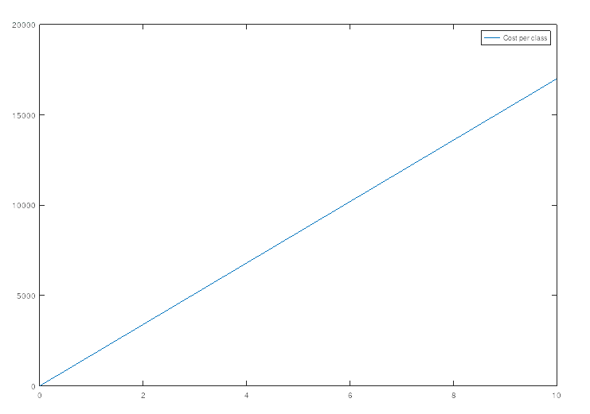
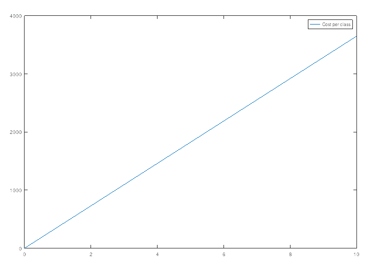
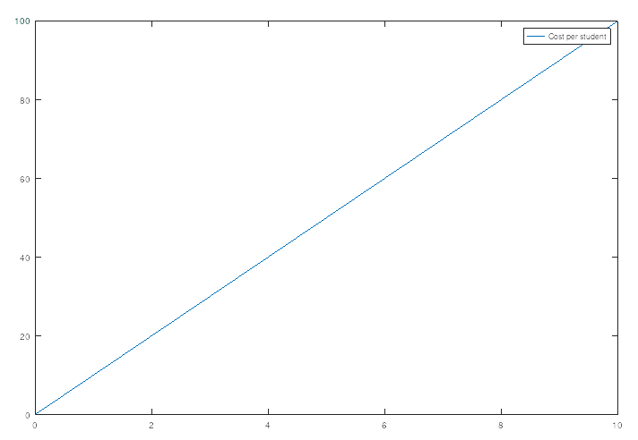

# Attendance System

# Introduction and Objectives

Taking attendance by hand is so 2000ish; it's prone to human error and time-consuming —especially in classes where there are many students— the same problems of taking attendance manually are applicable when compiling this data into digital format.

We propose an IoT-based solution to automate taking attendance: students are responsible for registering their attendance, and integration with the technology used by the instructors, e.g., Google Sheets, is automated.

# Different Approaches

There are multiple different approaches to register attendance:

## Biometric Fingerprint

This solution uses a biometric fingerprint sensor to record the student's attendance.

### Pros

1. No special card is needed.

### Cons

1. While enrolling the fingerprints, fingers must not be swollen and should not have scratches. Also, they should be neither damp nor dry. Students’ fingerprints must be properly clean. Orientation of fingers on FPS is also necessary. [[1]]()

   

2. Might be a cause of spreading infections and diseases.
3. Data breaches of fingerprints.

### Economic Scalability

[Required Equipment](https://www.notion.so/82e00ff687ea489492f1addb4d5d54f2)

$$CostPerClass = 500 + 250 = 750$$
$$CostPerStudent = NumberOfStudents \times 0 = 0$$

## Computer Vision

This solution uses computer vision techniques, such as facial recognition, to record the student's attendance.

### Pros

1. No special card is needed.

### Cons

1. Personal Privacy; some people might object to taking photos of them.
2. Needs a powerful micro-controller to make the system receptive.
3. Its accuracy might be decreased due to changes in people's looks; shaving a beard or pulling an all-nighter, especially the training will be mostly one-shot learning.

### Economic Scalability

[Required Equipment](https://www.notion.so/7dc7307caac44e4aadc535cf362efb2d)

$$CostPerClass = 300 + 1400 = 1700$$
$$CostPerStudent = NumberOfStudents \times 0 = 0$$

## RFID (Radio Frequency Identification)

This solution uses RFID cards which are unique for each student, where the student's attendance is record by reading the student's card.

### Pros

1. Contactless; doesn't contribute to spreading infections.
2. Accuracy doesn't deteriorate due to human-related factors, as in the fingerprint and camera-based solutions.

### Cons

1. A special card is needed.

### Economic Scalability

[Required Equipment](https://www.notion.so/8e586a174dcc470095057ac621d9815f)

$$CostPerClass = 115 + 250 = 365$$
$$CostPerStudent = NumberOfStudents \times 10$$

## Barcode

This solution uses a camera module that scans a barcode on the student's ID to record the student's attendance.

### Pros

1. Same pros of RFID.
2. No special card is needed.

### Cons

1. Dedicated barcode scanners are expensive.

### Economic Scalability

[Required Equipment](https://www.notion.so/27f2d088e21c4895838c7d751a278e4f)

$$CostPerClass = 175 + 250= 425$$
$$CostPerStudent = NumberOfStudents \times 0 = 0$$

# Main Components

We will be using the last approach (Attendance system using barcode on student's ID), the following diagram illustrates the workflow of the IoT system:

1. Set up a webhook on Google's `[Apps Script](https://developers.google.com/apps-script)`,
2. The ESP will call the App Script webhook whenever a student card is scanned,
   1. The student's barcode is scanned using the camera module.
3. The App Script will update the Google Sheet.
4. The student's attendance is recorded into a sheet which serves the purpose of a simple database.
5. Build a few custom widgets for Google Sheets that can be used for analytics, e.g., a heatmap of students attendance.
6. (optional) Set up a notification system that alerts the student's parents whenever a student is absent for more than 3 successive days.
7. (optional) Make a dashboard that connects the ESP to a specific sheet, i.e., a different sheet for each class.

# References

[1] _IoT Based Biometric Attendance System, International Journal of Electrical Engineering & Technology, 11(2), 2020, pp. 156-161._
